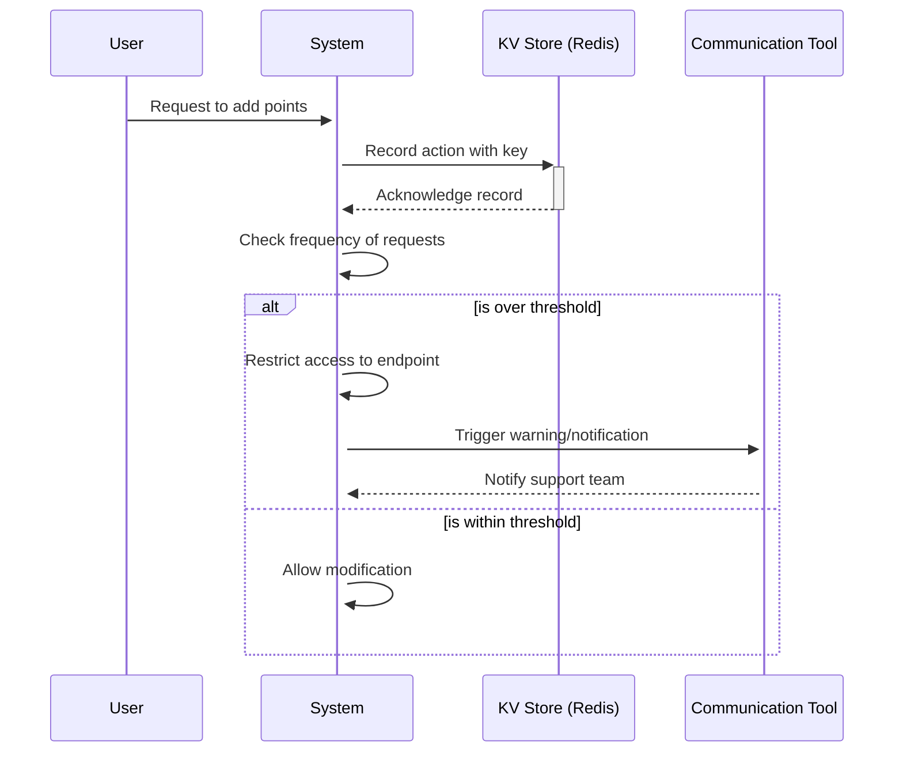
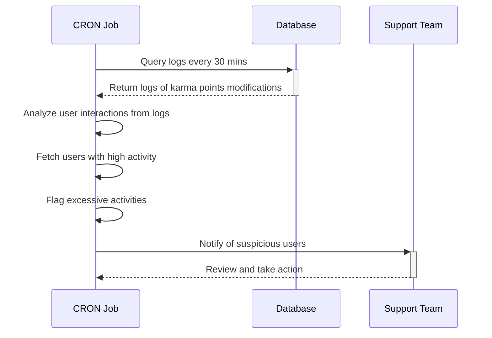
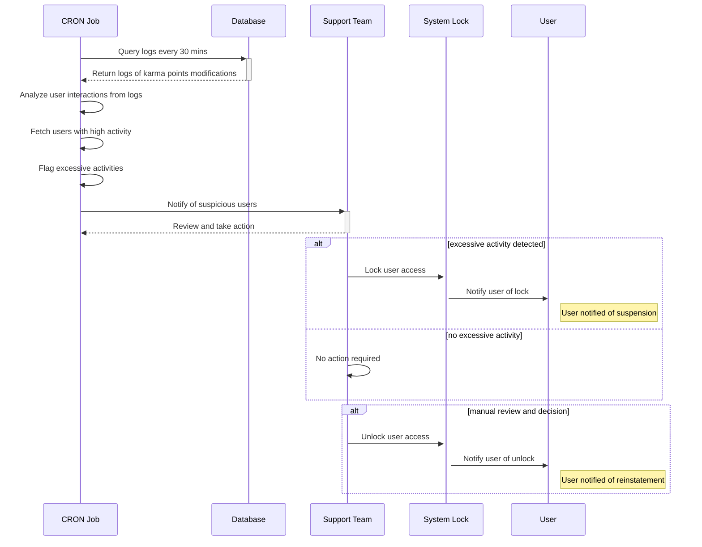
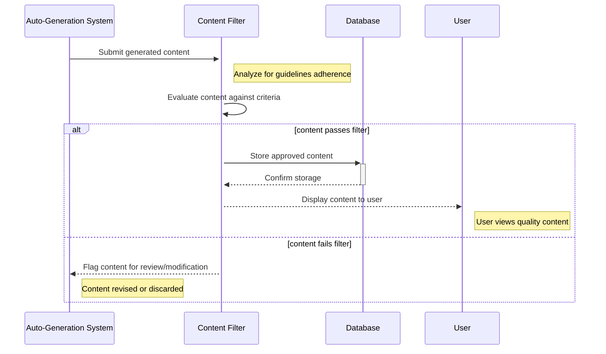
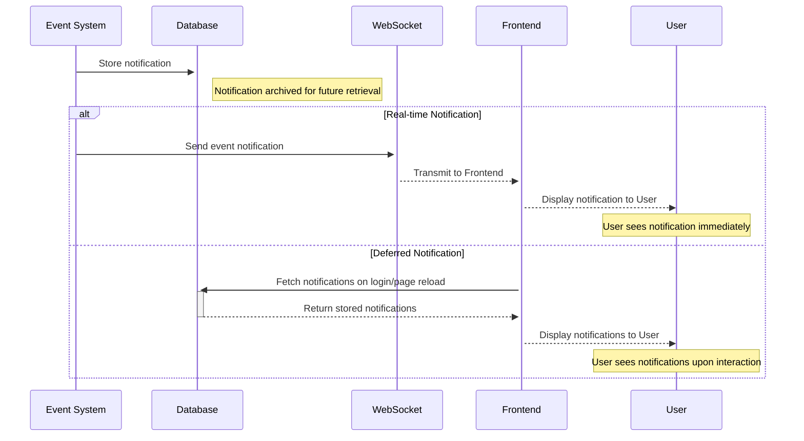

# Circls challenge

## Non functional requirements

### Karma point abuse

> there are many possible mechanisms to handle this problem so I'll lay out some of the ones that I believe are more important and useful

#### Backend approach
> The reason to start this approach from the backend is that backend strategies are more efficient and better to mitigate this kind of issues.

##### Karma point abuse
Rate limiting: to enhance security and prevent misuse, implementing rate limiting is an effective strategy, particularly for operations involving user points modification. Upon receiving a request to add points to a user's account, the system will record this action in a Key-Value (KV) store, such as Redis. This involves creating a key associated with the user's account modifications, specifically for Karma points adjustments. By monitoring the frequency of requests from a user, if the number of attempts to modify Karma points exceeds a predetermined threshold within a certain timeframe, the system will restrict further access to the endpoint for that user. This measure ensures a safeguard against abuse, maintaining the integrity and fairness of the points system. This can trigger warnings in the system and send notifications over to slack or any other communication tool that the support team may use.

Historical karma points writes to the DB: To ensure the integrity of our karma points system, we can implement a monitoring mechanism utilizing a database (DB) table that logs all actions affecting a user's karma points. By establishing a service equipped with a CRON job, we can systematically review this log every thirty minutes. This process identifies users with exceptionally high levels of activity in the karma points table, flagging those whose activity exceeds plausible human capabilities. Such anomalies are indicative of potential abuse of the karma points system. Upon detection, the system automatically alerts the support team, highlighting only those users exhibiting suspiciously high activity. This targeted alert system enables the support team to efficiently investigate and address potential abuses, maintaining the platform's fairness and integrity.

Introduce a system lock feature: This function allows the support or administrative team to temporarily suspend users' access to the karma system. To reinstate a user's access, a member of the support or administrative team must manually perform an unlock action. This measure ensures that the team retains direct control over user participation in the karma system, enhancing security and compliance by enabling timely intervention when necessary.

Implementing content filtering for auto-generated blog posts, questions, and answers is essential for maintaining high-quality, relevant, and appropriate content on platforms. This process involves the use of algorithms or set criteria to review and approve content before it goes live. The aim is to ensure that all auto-generated content aligns with community guidelines, is free from inappropriate language, misinformation, and spam, and provides value to the readers. By filtering content, platforms can enhance user engagement, trust, and satisfaction, while minimizing the risk of spreading harmful or irrelevant information.

##### Admin time saturation
Leveraging the previously outlined systems, only exceptional cases—outliers in user activity—will prompt a notification within the communication tool utilized by the support team. This ensures that only significant instances are brought to the team's immediate attention, eliminating the necessity for continuous manual oversight of the karma points system. By focusing on these key alerts, the system streamlines the monitoring process, allowing the support team to prioritize their efforts on investigating and addressing potential abuses efficiently, thereby maintaining the integrity and fairness of the points system.

##### Member awareness
Develop a comprehensive notification system that archives alerts within the database, enabling retrieval via the frontend to inform users of significant activities. For real-time notifications—whereby users receive immediate alerts while logged in—a dedicated event system is essential. Upon the occurrence of specific events, such as the activation of the karma system lock, this system promptly dispatches an event notification through a web socket directly to the frontend. Concurrently, it ensures these notifications are also stored in the database. This dual approach guarantees users are kept abreast of critical updates in both real-time and during subsequent sessions, enhancing user engagement and system transparency.

## Functional requirements
1. The platform must allow the admin to login and visualize potential point abusers. 
	Leveraging the system architecture previously described, it becomes straightforward to display reports generated every 30 minutes, allowing for the creation of a dashboard for the support team. This dashboard will provide comprehensive insights into user interactions, including the locking, unlocking, and modification of karma points. Such a tool not only enhances the support team's ability to monitor and manage user activities efficiently but also ensures a seamless operational flow in maintaining the integrity and fairness of the karma points system.
2. The admin must be able to adjust points as he sees fit for a particular member.
	This functionality will be seamlessly integrated into the karma points administration panel, enabling support team members to effortlessly search for a user by username or email. Once located, they can directly modify the user's points as needed. This streamlined process enhances the efficiency of managing user interactions and ensures a smooth, user-friendly experience for the support team, allowing for quick and effective adjustments to the karma points system.
3. The member should be able to understand this change in points without having to perform a proactive action.
	Building upon the previously outlined architecture, we will implement a dedicated notifications database and system. This setup ensures that all notifications pertaining to changes in user karma points are processed efficiently. Through this specialized system, any alterations or updates affecting user karma points are reliably captured and communicated, maintaining a seamless flow of important information.

## Technical implementation explanation (front end)
### Project structure
We employ Domain-Driven Design (DDD) by organizing all relevant code for each service within its respective directory, such as karmaService, userService, and envService. This modular approach allows for the composition and utilization of these services across various pages, enabling us to tailor and combine functionalities to meet specific feature requirements efficiently. This strategy not only enhances code maintainability and scalability but also facilitates a clear separation of concerns, allowing teams to develop, update, and debug features with greater agility and precision.

### Project Capabilities

- **Exclusive Karma Dashboard**: A secure, admin-only interface where administrators have the ability to modify any user's karma points. Access it here: [Karma Admin Panel](https://circls.chiguire.dev/karma-admin/).
- **Seamless Authentication**: Integrated login and logout features, bolstered by robust session management via Next Auth, ensuring a secure user experience.
- **Optimized Deployment**: The project is hosted on Vercel, accessible at [https://circls.chiguire.dev/](https://circls.chiguire.dev/), demonstrating our commitment to delivering high availability and performance.
- **Tailwind CSS Integration**: Utilizes Tailwind for streamlined and aesthetically pleasing site styling, enhancing user interface and experience.
- **Comprehensive Backend Functionality**:
    - An API endpoint to fetch a comprehensive list of users along with their respective karma points, enabling efficient user management.
    - Admin-exclusive functionality to adjust a user's karma points, providing granular control over user engagement and contribution rewards.
    - A dedicated service to retrieve a user's karma points using their email, facilitating personalized user support and management.

### Upcoming Enhancements

- **Karma Points for User Engagement**: Introduce mechanisms for users to earn karma points through various actions, including:
    - Publishing blog posts.
    - Posting comments.
    - Successful user referrals.
- **Collaboration with Designers**: Partner with professional designers to develop the interface based on a cohesive design system, enhancing visual appeal and user experience.
- **Robust Input Validation**: Strengthen security and data integrity by implementing comprehensive input validation across all forms and endpoints using the Zod library.
- **Advanced Form Management**: Upgrade form handling for improved user interactions and data processing efficiency with react-hook-form.
- **Real-time Notifications**: Deploy a live notification system to keep users informed of relevant activities and updates in real-time.
- **Karma Points History Tracking**: Maintain a detailed record of karma points transactions and changes within the database for transparency and auditing purposes.
- **Performance Optimization**: Utilize libraries like react-query to enhance the performance of client-side fetch requests, reducing loading times and improving the user experience.
- **Structured Testing Strategy**: Adopt a pyramid testing strategy, focusing primarily on unit and integration tests, complemented by end-to-end tests for critical workflows such as registration, login, and logout. This approach ensures reliability, performance, and high-quality user experiences.

### Key Links & Information

- **GitHub Repository**: Delve into our source code and contribute to the evolution of our project. Visit us on GitHub: [Circls Repository](https://github.com/chiguiredev/circls).
  
- **Project Workflow Dashboard**: Stay updated with our latest developments and monitor the project’s progression. Check out our Kanban board: [Project Dashboard](https://github.com/users/chiguiredev/projects/3/views/1).
  
- **Admin Access**: For administrative insights and controls, log in with these credentials: Email: rafaelsalass20@gmail.com, Password: !LDdK%x6MuYgEN. This access allows for a comprehensive overview and management capabilities.
  
- **User Registration**: Simply head to [Register Here](https://circls.chiguire.dev/register) and sign up using your email and a secure password.
